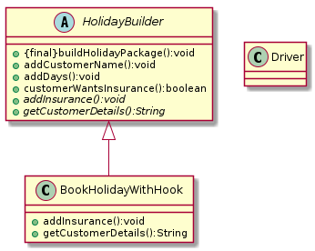

# TemplateMethod
Template Method is a behavioral design pattern that defines the skeleton of an algorithm in the superclass but lets subclasses override specific steps of the algorithm without changing its structure.

## Pros
You can let clients override only certain parts of a large algorithm, making them less affected by changes that happen to other parts of the algorithm.
You can pull the duplicate code into a superclass.

## Cons
Some clients may be limited by the provided skeleton of an algorithm.
You might violate the Liskov Substitution Principle by suppressing a default step implementation via a subclass.
Template methods tend to be harder to maintain the more steps they have.

## Relationships to other patterns

Factory Method is a specialization of Template Method. At the same time, a Factory Method may serve as a step in a large Template Method.

Template Method is based on **inheritance**: it lets you alter parts of an algorithm by extending those parts in subclasses. Strategy is based on **composition**: you can alter parts of the object’s behavior by supplying it with different strategies that correspond to that behavior. Template Method works at the **class level**, so it’s **static**. Strategy works on the **object level**, letting you switch behaviors at runtime.

